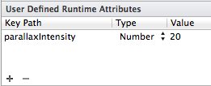
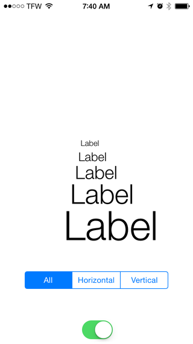
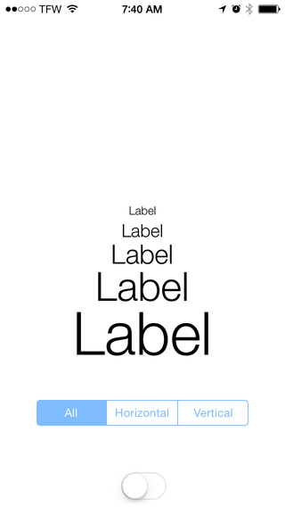

NGAParallaxMotion
=================

A tiny category on UIView that allows you to set one property: `parallaxIntensity` to achieve
a parallax effect with `UIMotionEffect`.

Show the parallax effect in one line
-------------
```Objective-C
theView.parallaxIntensity = 10;
```
Positive values make the view appear to extend from the screen. Negative values
make the view appear to recess behind the screen.

Interface Builder
-----------------

Additionally, you can set this property within Interface Builder by editing the "User
Defined Runtime Attributes" and adding:

    KeyPath           |  Type  | Value
    ----------------------------------------------
    parallaxIntensity | Number |  your depth value





Examples
--------

### On



### Off




License
-------
This code is under the MIT license.


Release Notes
-------------

### 1.1
- Added new direction constraints (Thanks @arunaharsa!)

### 1.0
- Initial Release
